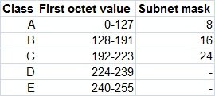

[README.md](README.md) 
#   <centre><b>CLASSES OF IP ADDRESSES</b> 
 
TCP/IP defines five classes of IP addresses: class A, B, C, D, and E. Each class has a range of valid IP addresses. The value of the first octet determines the class. IP addresses from the first three classes (A, B and C) can be used for host addresses. The other two classes are used for other purposes – class D for multicast and class E for experimental purposes.

The system of IP address classes was developed for the purpose of Internet IP addresses assignment. The classes created were based on the network size. For example, for the small number of networks with a very large number of hosts, the Class A was created. The Class C was created for numerous networks with small number of hosts.  
Classes of IP addresses are:  

|     CLASS     |
|---------------|---------------|-------|
|       A       |   1 ==>  127  | 0000  |
|       B       | 128 ==>  191  | 1000  | 2^7 = 128
|       C       | 192  ==> 223  | 1100  | 2^7 + 2^6 = 192
|       D       | 224  ==> 239  | 1110  | 2^7 + 2^6 + 2^5 = 224
|       E       | 240  ==> 255  | 1111  | 2^7 + 2^6 + 2^5 = 255
