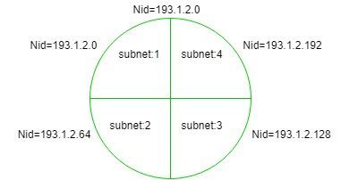

[README.md](README.md)

#  Finding Network ID of a Subnet (using Subnet Mask)

    
In order to find network id (NID) of a Subnet, one must be fully acquainted with the Subnet mask.

Subnet Mask:
It is used to <b><u>find which IP address belongs to which Subnet</u></b>. It is a 32 bit number, containing 0’s and 1’s. Here network id part and Subnet ID part is represented by all 1’s and host ID part is represented by all 0’s.

Example:
If Network id of a entire network = 193.1.2.0 (it is class C IP).

In the above diagram entire network is divided into four parts, which means there are four subnets each having two bits for Subnet ID part.

        Subnet-1: 193.1.2.0 to 193.1.2.63
        Subnet-2: 193.1.2.64 to 193.1.2.127
        Subnet-3: 193.1.2.128 to 193.1.2.191    
        Subnet-4: 193.1.2.192 to 193.1.2.255 

The above IP is class C, so it has 24 bits in network id part and 8 bits in host id part but you choose two bits for subnet id from host id part, so now there are two bits in subnet id part and six bits in host id part, i.e.,

    24 bits in network id + 2 bits in subnet id = 26 (1's) and
    6 bits in host id = 6 (0's)

    Therefore,

    Subnet Mask = 11111111.11111111.11111111.11000000 = 
                            255.255.255.192

If any given IP address performs bit wise AND operation with the subnet mask, then you get the network id of the subnet to which the given IP belongs.
 Example-1:

    If IP address   = 193.1.2.129 (convert it into binary form)
                    = 11000001.00000001.00000010.10000001
    Subnet mask     = 11111111.11111111.11111111.11000000
    Bit Wise AND    = 11000001.00000001.00000010.10000000
    Therefore, Nid  = 193.1.2.128

    Hence, this IP address belongs to subnet:3 which has Nid = 193.1.2.128

 Example-2:

        If IP address  = 193.1.2.67 (convert it into binary form)
                       = 11000001.00000001.00000010.01000011
        Subnet Mask    = 11111111.11111111.11111111.11000000
        Bit Wise AND   = 11000001.00000001.00000010.01000000
        Therefore, Nid = 193.1.2.64
Hence, this IP address belongs to subnet:2 which has Nid = 193.1.2.64